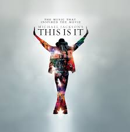

# 就是这样

大概10年前，迈克尔杰克逊向世界宣布由于个人身体原因，将在举办“This is it"告别演出后离开舞台。但是就在演出前几天，世界接到了MJ突然去世的消息。

我不知道我为什么在自己的大学生活即将结束的时候一定要有一个总结，一定要有一个仪式来表达以后自己就不做这些事情了。我只知道自己写的某些文章确实吃力不讨好。既然以后有更多回报更丰厚的计划，那么只好把这些文章扔掉，转而写一些技术文章，一些技术总结。

无论是我在大学期间常写的带一些艺术感的文章，还是我在大学阶段的朋友圈里经常带有各种私货的消息，我对这些东西的评价永远不能和别人对这些的评价完全一致。有些说很难理解；有些说并没有人在意；有些说我不应该这样写。我在同意他们的观点后写的次数越来越少，逐渐往讴歌类型发展，并逐渐发展写技术报告的趋势。

我想请世界思考这个问题：什么是艺术（Art）？这是一种很难理解的东西？或者是某种脱离生活的产物？其实我探讨艺术方向的初衷很简单：我在做某篇英语阅读的时候了解到理工科学生需要艺术方面的修养。换句话说，我了解到理工科需要有艺术修养的从业者时，就开始了大学期间的探索。所以对于我来说，艺术并不高雅或者脱离现实。对于我来说，艺是经史层面的术，术是科学层面的艺。

如果一样样说自己在思考艺术的过程中有哪些成绩，这篇文章可能会写得很长。无论是对别人的贡献，或是对自己的提升，简单的一篇文章似乎很难概括。好在我集中用来整理文章的地方是GitHub，这个平台基于一个所谓“支持时间旅行”的数据结构，能够让我很好地管理自己的文章。（实际上，GitHub本身就是一个当代的高雅艺术）

## 思维的艺术

让我先说最重要的成绩：思维。大学在亚里士多德的雏形时期只是一个很单纯的研究数学，逻辑学的地方。随着和工业化的结合，不同的大学以不同的理念在全世界多点开花，并结合当地的需求随时发展办学理念。我读书的校园是北京邮电大学。这是一个重点培养理工科现代化高级人才的学府，也即将成为我引以为豪的母校（写文章的时候是毕业前最后一个寒假）。北邮希望自己的学生能够厚德博学，敬业乐群。

很遗憾的是：大多数的我们与其说不知道这个理念代表着什么，更像是不关心这个过于“遥远”的理念。从某种角度说，相当一部分的我们认为：我们的校训是校长们用特别高雅的词汇拼凑在一起充当门面的漂亮口号，而现实早就过于复杂。

所以就出现了这样的现象：有相当一部分人是带着看似和专业不相容的兴趣选择自己的专业，结果导致自己成绩越学越好，基础却越来越危险；有相当一部分人带着相当认真地态度从事项目研究，结果被老师告知你还年轻，正常情况下这点事一个人半天做完，而你们三个人用了半个月；“作业请独立完成”并没有促进绝大多数人的主动创新，而是成为了普遍的竞争压力，使每个人喘不过来气。

文章写到这里，我真的期待我在这里能说出一些金句。大家听完之后能够如获至宝，能够立刻改变局势，取得伟大的胜利。可我不能。思维的艺术性就在这里体现，关键的问题就像水下狡猾的鱼一样，你做错一步它就会立刻溜掉。

与其我们质疑这样的现象，我们可能更应该思考一下自己思维的本质。很抱歉，我不适合代替你们去说你们脑中在想什么，应该是自己思考这些。我常常感觉我的思维就像一摊烂泥巴，和水混合后难以成型。在很多努力尝试后，它被捏成了一个漂亮的形状，并随着风干而定型。

我们的思维为什么会像烂泥巴，这些不成型的烂泥是一个隐喻：懒。克服了烂泥巴后它得以定型，这里也是一个隐喻：定性。为什么要追求思维的艺术，实际上就是给我们确定一个草图，用草图决定我们的泥巴捏成什么样子。

思维的艺术无法取代训练思维的难度。但是会给我们一个很好的动机去从事这件事情。回到开头很多人的质疑部分，我其实特别理解这些说法也是因为充分理解了自己的隐喻。其实理解特别简单：比如说人现在是几个碳原子，想要通过压力变成钻石。人工造钻石的方法就是外界施加压力，结果就是没有多少原子真正组成了坚硬的结构；但是天然的钻石却达到了极大范围的紧密结构。我们现在就有很多人为制定的努力。这些努力虽然带来了广义上的成绩，但是你看各种细节其实全都是漏洞。

## 全站预告
我准备了很多好东西，包括个人研发的自学系统。大学结束前我会一直抽空写。欢迎大家。