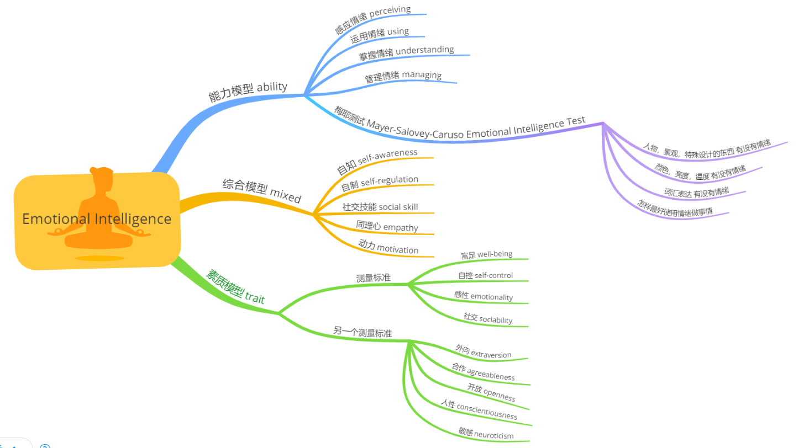
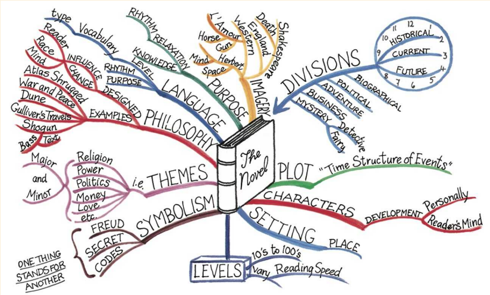
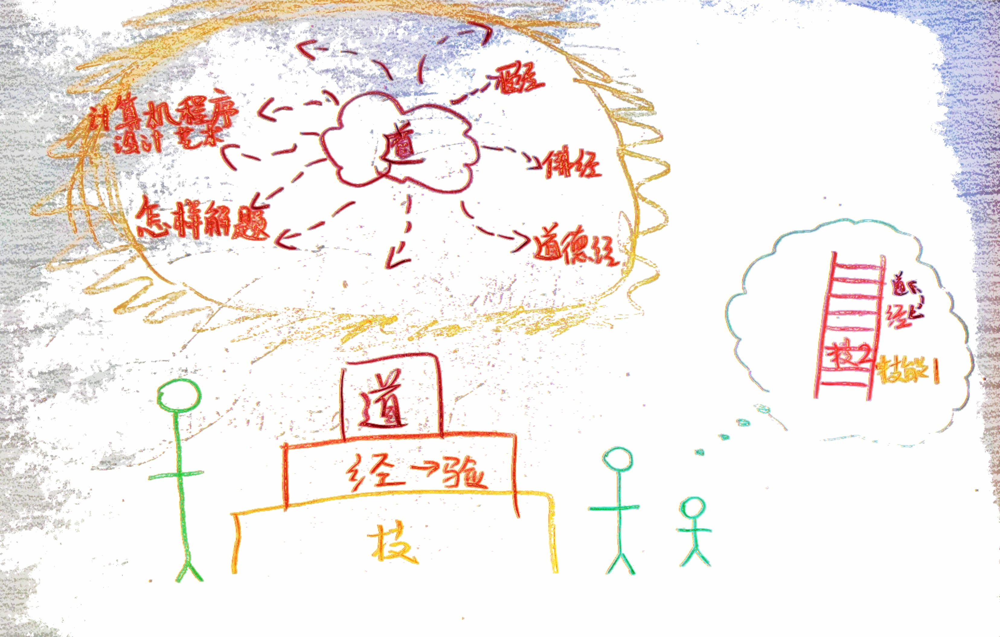

# 年轻人的自我修养

## Felix闪亮登场

Felix是一个比你们想象中还要普通的男性大学生。他喜欢打游戏，却谁也打不过。他喜欢一天天闲着不动，就是刷手机。他舍不得吃小浣熊，所以当打折的时候他会血拼。但是Felix要考虑一个这个世界上每个人都要考虑的最重要的问题：如何好好活着？

最开始他以为这个问题很好回答：书上写了，好好活着是说远离毒品，为社会做贡献；妈妈说了，好好活着就是不要压力过大，多交朋友；女朋友说了，好好活着是指不要疏远自己的家庭，两个人一起开开心心过一辈子。

Felix一直觉得哪里不对。他一直是一个成人的外表，思维上却一直保持小孩子一般的敏锐度。他开始焦虑，什么叫好好活着？眼见自己临近步入社会，身边的何同学用高超的vlog技术让自己火遍全网；豆子同学不仅学习科研行政三手抓，还争得了女朋友，家长们，老师们，同学们的一致爱戴。什么叫好好活着？

Felix有自己擅长的事情，但是做这些事情不过瘾，感觉自己只不过是在重复一些最基本的原则而已。

Felix有喜欢做的事情，但是很多时候事情的真相不容他想象。过于美好的表面下隐含各种潜规则，喜欢的东西最终反倒成为了累赘。

Felix也有必须要做的事情，但是随着这样的事情在生活中的比例越来越大，Felix担心自己会被“必须”完全控制，他不再会有灵魂。即便将来某个节点会摆脱这样的束缚，他到那时还会不会怀念过去的时光？Felix不知道，但他有预感自己不会怀念天天只做“必须做”的事情。

有时候Felix甚至无暇顾及有什么事情，真实的生活是未知的。可能某一天Felix从梦中醒来，发现自己已经被牵着鼻子走；可能某一天Felix早上起来被一位很仰慕的学长通过微信吼了很久，或者仅仅是因为早上的卷饼过于咸，鸡蛋过于腥导致自己拉肚子，这一天为了甩脱自己的坏心情，无论什么事情可能都要往后推推...

Felix并没有成熟的心智，他只是个年轻人；Felix并没有经过社会的考验，他只是个年轻人；Felix不能用很好的人脉资源去获得这些问题的解答，他只是个年轻人。Felix甚至在18岁那年都没有积累任何高素质，他是个学习不好的年轻人。

## E-work

真正的自我修养来源于一个天才和另一个天才之间心灵的暗合。Felix虽然是一个普通人，但从自己的角度出发，永远自己是天才。Felix遇到过很多贵人，有几位贵人在他骄傲自满的时候填充了他空虚的内心；有几位贵人在他随大流的时候指点了少有人走的捷径。但对于Felix来说，他只遇到了五位贵人。

### 第一位贵人告诉Felix情商是一切的根本

在陈述情商很重要之前，他让Felix查找情商的[国际概念](https://en.wikipedia.org/wiki/Emotional_intelligence)

半懂不懂地，Felix开始约束自己的情商模块。虽然还没有学如何训练情商，Felix发现很多时候谜底就在谜面上。比如Felix发现自知可以是是起床的时候知道自己起床了，并且知道新的一天已经开始了。逐渐Felix发现自知也可以是自己在做科研的时候发现论文的这句话提及了一个重要概念，概念推导出一系列性质；因此就可以发现下面哪几句话假定Felix已经了解了这些性质。

逐渐Felix发现自己平时情商也真的很低。比如说Felix爱好刷[哔哩哔哩](https://www.bilibili.com/)，但总是茫然地下拉主页面刷新，偶尔点进去看一个视频，但是哔哩哔哩有很多模块，可以通过收藏某些视频加快查找效率；可以订阅某些话题加快浏览效率；甚至可以直接收藏某个标签，以后与其下拉刷新，Felix不如浏览收藏的各种标签。逐渐Felix发现情商高了以后，自己并不是在用哔哩哔哩，而是在和它聊天，把一个软件当成自己的朋友。听起来挺奇怪，但是哔哩哔哩响应时代潮流，会实时更新很多重要的信息。比如说在2020年，哔哩哔哩推出了疫情模块响应新冠疫情，和小康模块响应十三五完美收官。跟哔哩哔哩聊天反倒比跟好朋友聊天更有话题。

想到曾经某位北京大学光华管理学院毕业的高管如此评价哔哩哔哩：点进去发现全是鬼畜，看它的孩子都是神经病吧。Felix笑了。

### 第二位贵人劝Felix趁年轻多用大脑

这位贵人在Felix认识他的时候[已经去世了](https://zh.wikipedia.org/wiki/%E6%89%98%E5%B0%BC%C2%B7%E5%B8%83%E8%A9%B9)，但还是留下了[一些文字](https://book.douban.com/subject/27203302/)供Felix交流。

这位贵人告诉Felix笔记不是糊弄出来的，也不是照搬出来的，而是在认真分析后设计出来的。虽然反复强调大脑的很多神经学性质，他只想告诉Felix一点：人脑的深度和未知程度皆重于宇宙或深海。但是由于很多刻板的习惯，随着我们群居生活越来越普遍，很多我们习以为常的看法可能都是错的，过时的。

噢！Felix明白了。原来这位贵人是[启发学派的](https://en.wikipedia.org/wiki/Heuristic)。也就是说人脑已经具备了我们想要了解的全部知识，但是大部分处于某种沉睡状态，必须靠定性的方法才能唤醒它。

Oops，定性是第三个贵人告诉Felix的。

### 第三位贵人教Felix如何定性

第三位贵人不愿意解释，但是擅长启发。他问Felix累是因为啥？Felix哪知道去。

他就跟Felix讲了一件事：

常听人说：除了生死无大事。

这种空洞的语言，似是而非，却无法反驳。

日常中，确有很多伴随左右的生死问题，零零散散、花样百出，却凑不成一件大事。

其中，有三类最为揪心：一是事业、二是感情、三是身体。

只关注身体的生死，根本无法着手。死了就是死了，没死就要奋斗。一旦病倒，全听医生的宣判和处置。这是现代人的宿命。

我曾间接得知，一位远方的好友被医院检查出绝症。我想，不能扩散这消息，更不能主动询问，只能假装不知道，以便他安心静养。这不是我表达感情的机会。

可以断定：他身体确实有了问题，医院不会骗他。但他心里又添了一个更大的问题，就是恐惧和绝望。身病心病，祸不单行。

意外的是，数月后又间接得知，他通过保守疗法和精神自救，恢复得很好。

我这才敢跟他联系，祝贺他治好了自己的心病。

又对他说：没什么绝症这回事。我曾经抑郁，惶惶不可终日，一分钟都不想多待，活得极不耐烦，随时可能一转脸人就主动没了。有什么绝症能比这个死得更快？

我采取的秘方，就是定性练习。当时很年轻，不敢叫修炼，也没有体系，都是随机的方法。不过，也有标准：顺心而行，怎么舒服怎么来。

如果一件事非要坚持，说明自己是抗拒的。对身心出了问题的人，等于雪上加霜。

习惯成自然，多半是恶习。

自然成习惯，才是现代人修炼的正途。

无论事业、感情、身体，在生死关头，定性的作用举足轻重。

平时的效果，更为显著。至少，能让我们冷静应对生命的变化无常。

Felix听完后，原封不动地把所有话整理了下来，并开始定性训练。

### 第四位贵人教Felix如何写作和定投

第四位贵人对Felix说：Felix，你一定要养成写作的习惯。

Felix说，嗯，我知道。写作嘛，我小时候作文经常被老师拿来念。练习技巧就是勤写。

贵人说：不，Felix。我建议你养成写作的习惯，不是说建议你练写作的能力。我建议你写作，是为了把整个过程当成一个很重要的工具。

Felix没有听懂，因为工具是用来完成某个比较难的任务的。Felix从没想过把写作用于最实干的场景里面。

贵人说：Felix，我建议你养成写作的习惯。通过坚持写作，你在[定投](https://www.zhihu.com/question/38558915)上一定会做得很好。

Felix更困惑了。因为自己没有任何定投的习惯，因为自己没有钱。

贵人说：Felix，即便你有钱，我说的也不是让你做别人都在做的事情。你想一想，比如大家都在这里钓鱼，你是新来的，和这么多人抢，能钓得上鱼吗？

Felix觉得，大家都在这里钓鱼，那么一定意味着只有这个地方才有鱼。别的地方都钓不上来，才都上这里面的。

但贵人不想理会Felix，他继续说：在没有钱的时候，人反倒是最富有的。钱无非是对某个组织的credit，也就是信赖。在没有用钱完全取代信赖之前，人是相当有信任感的。这个时候的人有敏锐的注意力，有最高的天赋。是的，我让你定投，说的就是让你用精力去投资某件事，或某个人。

Felix终于懂了，开始提问：很多事，很多人，我现在看不懂怎么办？

贵人：学。

Felix：事和人太多，我学着后面忘了前面怎么办？

贵人：所以你一定要养成写作的习惯。写作是贯通整个流程的。文章质量的好坏决定了你投入的质量多少。而且你随时可以对之前的文章分析综合。利莫大焉。

Felix同意了。但是还是有个小心思，因为写作一般很耗费时间，好的文章他可能用几小时，甚至几天，几个月时间完成。他担心效率不够高。

贵人说：我也有这样的想法，本质上来说你不用担心这个。但是如果确实很担心的话，你就到互联网上，图书馆里直接阅读别人的写作呗。我也不是总是现在这样，坦白讲我在年轻的时候很多阶段没有工作，而且当时还面临房贷的压力。但是无论什么时候，我都以极为开放的视野做阅读工作（Felix想起来，之前第一个贵人让Felix了解情商的时候，Felix当时发现有一个情商的重要元素就是开放Openness）。我在社交媒体上有1.8k的关注量，我从不和其他人一样关注自己的粉丝数，因为是这1.8k的关注量，和我每天特别开放的阅读系统，让我无论处在生活中的任何阶段都能顺利走出困境并迎来成功。

这位贵人对自己最宝贵的精神财富不仅不收取一分钱的费用，还主动向Felix提供了[一切](https://github.com/xiaolai)，[一切](https://coolshell.cn/)，[一切](https://github.com/sindresorhus/awesome)，[一切](https://www.zhihu.com/topic/21201318/hot)。

### 第五位贵人是互联网

Felix发现互联网上不仅什么都有，而且就是整个宇宙。

宇宙本无大小，人们有了直角坐标系，才会想着给宇宙划分大小。实际上物理学对宇宙的研究已经到了[十维](https://zhuanlan.zhihu.com/p/103127976)。整个宇宙在那里就是一个奇点，没有任何大小的概念。而互联网有一个不大响亮的名字：万维网。

在物理的世界上Felix对所有事情都可以持一个态度，但是在万维网构成的世界中不得不像一个成人一样没有态度。因为但凡一个态度存在于互联网上，这个态度的对立面就会同时被检索到，甚至屏蔽都屏蔽不过来。所以为了避免烧脑，Felix只是一个年轻人，却不得不和40岁的人一起养成某种不持态度的人生观；和80岁的人一起养成某种相信任何事物的人生观。

在物理的世界上Felix可以偷懒，但是在万维网构成的世界上Felix只有偷懒。Felix在年轻的时候曾经为了追求刺激人肉整个互联网。哇！负重伤而归。在物理的世界上，老师教授教导Felix：身体力行，艰苦奋斗；以好逸恶劳为耻，以骄奢淫逸为耻。但是在互联网上，Felix只是一个年轻人，却不得不响应习大大号召坚持可持续发展；不得不和所有人共同摸索最适合自己的节奏。

Felix发现，生存的概念完全变了。在过去，一个孩子做好孩子应该做的就很好；青年人做好计划内的事情就足够了。就算是最创新的年代也都是成年人守正出奇。现在无论一个孩子做的多么努力，都似乎不够好；青年人无论思想多么成熟，理论如何超前，都惊奇地发现自己已经落入了俗套。成年人大多数在线下已经构建了自己的美好生活，却没有能构建出孩子的。成人在线下如鱼得水，他们可以利用信息差盈利，可以用知识盈利，可以用技能盈利。但是在互联网必须利他的要求下，只有少部分开明的成人开了先河；大部分成人舍不得小利，即便是互联网上还是继续玩线下的那一套。

Felix想了又想，这一代大多数成人的理念为什么搬到互联网上不行？Felix的思维过程追溯到了特别特别早；Felix上小学的时候，由于特别擅长解数学题，Felix曾经特别兴奋地和母亲聊过自己的一个想法：班级课堂后面有一块黑板，平时大部分做黑板报，自己可以再后面开发一个小的分区，就叫每日一题。在这个分区上坚持每天做一道难题的解答。但母亲却以两个理由打消了Felix的计划：1. Felix的数学解题技能其实不那么好，还不够写“每日一题”。2.Felix的所谓对于数学题比较精妙的解答其实只是一层窗户纸，是Felix从阅读课外书总结出来的。但把它写出来的那一刻就好像秘密被揭露，如果别人就都掌握了，Felix就会变得不擅长解数学题。由于母亲当初上学时数学难题的解答做得比自己现在强很多，Felix从那时认定，母亲肯定是对的。事实上，母亲一直都是对的。

在听从过去很厉害的母亲，以及当下和自己很搭的互联网之间，Felix最终还是选择信了互联网。Felix是这样想的：上初中的时候Felix了解到最早的人类社会经历了自给自足的阶段，以物换物的阶段，等价交换的阶段，到后来就是用一张大家都信任的纸片子直接交换物，直到现在连纸片子都省了。互联网却从一诞生就进入到了现在的连纸片子都没有的终极阶段，可能就是因为这个很多成人信不过互联网。因为这样子的互联网只有一种生存模式：比如Felix在互联网上工作，需要用另一个人Alex的工作成果。但Felix不买Alex的成果，而是拿来就用，只需声明某部分成果是Alex的。在这个模式中Felix之前从未接触过Alex，但是Felix可以瞬间信任Alex能帮到自己，而且这个令人信赖的服务是完全免费的。如果Felix用这个工作成果还挣到了钱，基本不需要沟通，Felix的收益就自动分出了一部分划给了Alex。

哇！E-work。

## 入世

学习工作之后，必须回报世界，向众人汇报汇报。

Felix只是一个年轻人，明白年轻人的思想。

Felix总结，人学习应该是先培养慧根，这是需要自己悟道。比如说简单的“天行健，君子以自强不息；地势坤，君子以厚德载物”。这句话对于没有慧根的人来说只是一句很正确的废话。对于有慧根的人来说这也是废话，因为他的生命中已经包括了这句话背后的道理，具体的说法反倒没用了。

在确认你存在“慧根”之后，会学习经。以为某些东西对别人来说特别好用，但是直接套用到自己身上一点用都没有。这些东西就是需要学习的，最终把别人的经变成自己的验。

之后还需要掌握技，才能在社会上立足。技有小伎俩，也有大技术。Felix是学理工科的，小伎俩一般特别好使，花几个月的时间去研发，之后立马就可以拿到收益。非常爽。大技术一般要比较寂寞，研发三年把整个架构翻新。这样的话是没法赚快钱，但是你研发的东西别人还真轻易取代不了。

但是问题在于，并非只有年轻人需要自我修养。现在可能各种身份，各种年龄，各种职位的人都要重新来一遍。他们可能根底不牢，可能忙于生计。所以必须是先把很直接的技掌握到位，在野心变大之后学习经，最后万道归宗，悟道圆满。

Felix下台鞠躬